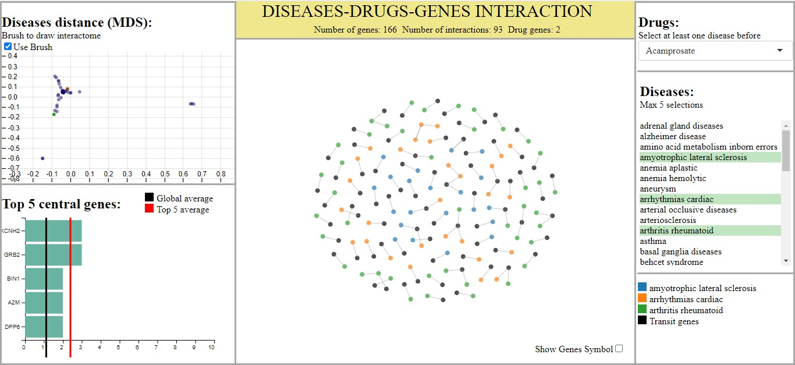

# VisualAnalytics
Final Project of Visual Analytics Course at Sapienza University

# Overview
The system is composed of three main visualizations plus some filter components. When it is loaded for the first time only Diseases Scatterplot View and sidebar with filters are visible, all the other views depends on user selection.  
The user is allowed to select at most five diseases. To select a disease to analyze, he can use interchangeably either the scrollable sidebar on the right side of the screen or the scatterplot on the left upper corner of the screen. According to this selection, the interactome node-link diagram is displayed. Once the interactome network graph is visible the user is allowed to select a drug and understand if there is some gene of the interactome affected by that drug. Top 5 centrality genes are also computed for the interactome of selected diseases and they are displayed to the user in the left lower corner. All other view-specific interactions and futher details are explained in the [report](Report/report.pdf).  
The project has been realized using d3.js library and OMIM datasets.

